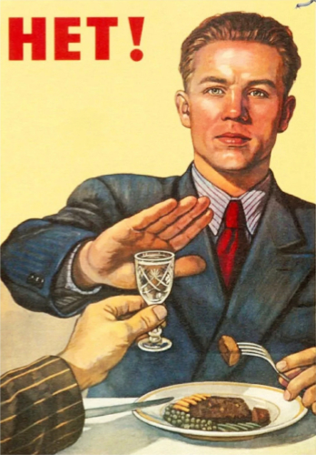

  

  <i>"Нет!" by Viktor Ivanovich Govorkov, 1954.</i>

# About

_Insist all you want. No, I will not consume your slop or participate!_

I created this repository to share custom [uBlock Origin](<https://addons.mozilla.org/en-US/firefox/addon/ublock-origin/>) filters with the express intent of blocking any AI-related features I come across. Some domains have settings for AI features, though many that do are _opt-**out**_ by default. These filters will only visually block elements and do not disable AI features, check relevant account settings accordingly.

# Installation

From the uBlock settings, navigate to the `My filters` tab and insert the contents of [`filters.txt`](filters.txt) as needed, ensure that custom filters are also enabled.

## _"Is my browser supported?"_

Other browsers and extensions are untested. I have, and only ever will update this using [Waterfox](<https://www.waterfox.com/>) with uBlock Origin under the assumption that other browsers are supported as long as they also support uBlock Origin.

# Creating New Filters

To create a new custom filter, select the eye dropper and click the desired element. Note that it is most ideal to also get all surrounding padding selected. It is not mandatory other than for contributions, but can leave empty space. You can `Preview` any current selections to see what it will look like. When creating a custom filter, use the sliders to adjust the scope of nesting for the element. This can vary dramatically site-to-site so there is no guaranteed consistency, though I prefer to adjust the left slider first, then the right. When finished with the selection, simply click `Create`.

## Disclaimer

Be advised that some elements may display information for other areas of a page or other separate pages. It is recommended to check the preview in addition to refreshing a page to ensure a given filter is applied consistently. Conversely, updates to a site may change element names and break filters, which may then need to be updated.

# Contributing

If you want to help expand these filters, all domains and specific elements for that domain **must** be labeled with comments, and be as briefly descriptive as possible. If a filter consists of multiple elements, only one comment is needed for each element per filter of a given type. Any contributions [**must be tested**](readme.md#Disclaimer) to ensure quality. Please follow existing formatting.
